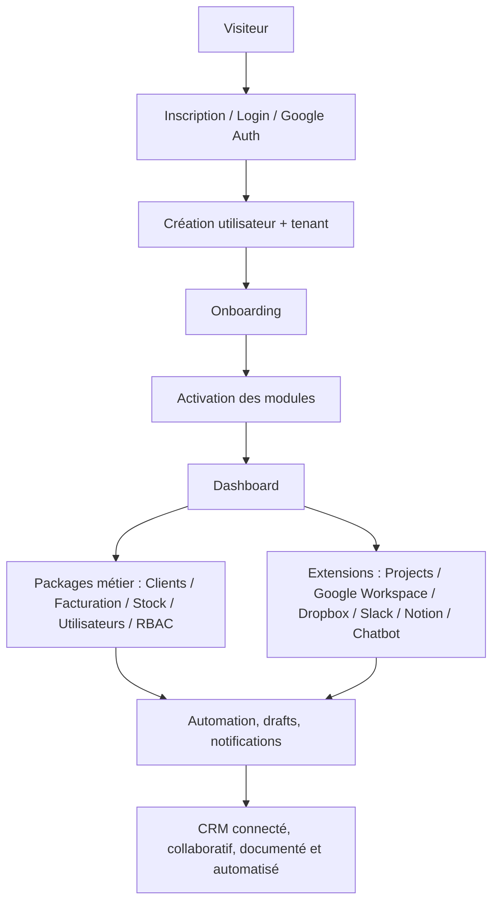

# Scénarios Projet CRM - De l'inscription à l'état final

## Objectif

Ce document résume le parcours produit du CRM Laravel depuis l'arrivée d'un utilisateur jusqu'à un CRM modulaire, connecté et automatisé.

Il couvre :

- le cœur applicatif
- les packages métier
- les extensions locales du repository
- les enchaînements fonctionnels entre modules

## Vue d'ensemble

## 1. Parcours principal

### Phase 1 - Inscription et authentification

L'utilisateur :

- arrive sur `/login`
- crée un compte ou se connecte
- peut utiliser l'authentification classique ou Google

Résultat :

- un utilisateur existe
- un tenant existe ou est associé
- la session applicative est ouverte

### Phase 2 - Contexte tenant

Le système détermine le tenant actif et applique l'isolation multi-tenant.

Résultat :

- toutes les actions suivantes sont scoppées par `tenant_id`
- les modules ne mélangent pas les données d'entreprises différentes

### Phase 3 - Onboarding

Le wizard initialise :

- le profil
- l'entreprise
- le secteur
- les premières applications à activer

Modules mis en avant dès l'onboarding :

- `clients`
- `invoice`
- `stock`
- `projects`
- `notion-workspace`
- `google-drive`
- `google-calendar`
- `google-sheets`
- `google-docx`
- `google-gmail`

### Phase 4 - Dashboard

Le dashboard devient la porte d'entrée du tenant.

Il agrège selon les modules actifs :

- clients
- devis
- factures
- paiements
- projets
- tâches
- stock
- activité récente
- brouillons récents

## 2. Cœur métier

### Clients

Objectif : centraliser le référentiel commercial.

Parcours :

- création de fiches client
- enrichissement par notes, tags, contact, statut
- préparation des flux devis / facture / projet

### Facturation

Objectif : transformer la relation client en revenu.

Parcours :

- création de devis
- conversion en facture
- paiements
- exports et reporting

### Stock

Objectif : gérer articles, fournisseurs et commandes.

Parcours :

- catalogue produits
- approvisionnement
- préparation à l'intégration avec facturation

### Utilisateurs et RBAC

Objectif : faire évoluer le CRM d'un usage solo vers une équipe.

Parcours :

- invitation d'utilisateurs
- rattachement au tenant
- rôles et permissions

## 3. Extensions et workspace connecté

### Projects

Objectif : relier la vente à l'exécution.

Parcours :

- création de projet
- liaison possible avec un client
- tâches, commentaires, fichiers, responsables
- ponts possibles avec Calendar, Drive et Dropbox

### Google Calendar

Objectif : gérer rendez-vous, jalons et rappels.

### Google Drive

Objectif : centraliser les fichiers projets et documents partagés.

### Dropbox

Objectif : proposer un stockage alternatif à Google Drive.

### Google Sheets

Objectif : travailler les données tabulaires et exports collaboratifs.

### Google Docs

Objectif : créer et maintenir des documents structurés.

### Google Gmail

Objectif : traiter la communication email depuis le CRM.

Particularité actuelle :

- mode temps réel via Socket.IO
- détection des nouveaux emails entrants via scheduler Laravel
- fallback propre si le socket n'est pas disponible

### Google Meet

Objectif : relier les réunions vidéo au contexte client et projet.

### Slack

Objectif : relayer l'activité CRM dans l'espace de communication d'équipe.

### Chatbot

Objectif : fournir un espace conversationnel temps réel ou quasi temps réel.

### Notion Workspace

Objectif : connecter le CRM à un vrai workspace Notion.

Important :

- l'extension ne simule plus un mini Notion local
- elle utilise l'API OAuth officielle Notion
- elle permet de :
  - connecter un workspace réel
  - rechercher des pages Notion partagées
  - lire les blocs de contenu dans le CRM
  - créer une page Notion réelle
  - lier une page à un client ou un projet

## 4. Automation, reprise et expérience moderne

### Suggestions intelligentes

Le moteur d'automation intervient après certains événements métier :

- création client
- création devis
- création facture
- création projet
- création tâche projet
- invitation d'utilisateur
- activation d'extension

Il peut ensuite proposer par exemple :

- envoyer un email
- planifier un rendez-vous
- créer une tâche de suivi
- créer un dossier Drive ou Dropbox
- créer ou ouvrir une page Notion
- ouvrir l'extension la plus logique pour finaliser un flux

### Gestion des authentifications expirées

Si une suggestion dépend d'une intégration expirée :

- la suggestion ne se perd pas
- elle repasse en attente
- l'utilisateur reconnecte l'extension
- une notification de reprise apparaît dans le header
- le clic sur la notification rouvre la suggestion concernée

Providers déjà couverts :

- Gmail
- Calendar
- Drive
- Dropbox
- Slack
- Meet
- Sheets
- Docs
- Notion Workspace

### Drafts et autosave

Les formulaires modernes du CRM utilisent un système de brouillons :

- autosave silencieux
- reprise de brouillon
- suppression après succès métier
- rappel différé seulement si la saisie reste inachevée

Flux déjà branchés dans le périmètre principal :

- création client
- création facture
- création projet
- création tâche

## 5. Desktop

Le projet possède maintenant un wrapper Tauri.

Objectif :

- distribuer le CRM en application desktop Windows
- garder Laravel comme cœur métier
- réutiliser les flux OAuth et l'interface existante

Le desktop n'est pas le cœur du produit, mais une couche de distribution supplémentaire.

## 6. État final cible

Un tenant mature peut atteindre un état où :

- les utilisateurs et rôles sont en place
- le référentiel client est structuré
- devis, factures et paiements sont suivis
- les projets portent l'exécution réelle
- les documents vivent dans Google Workspace, Dropbox ou Notion selon le besoin
- l'email et le calendrier sont connectés
- les brouillons évitent la perte de saisie
- les automatisations proposent les prochaines meilleures actions
- les reconnexions OAuth ne cassent plus les scénarios importants

## Conclusion

Le produit commence comme un CRM simple, puis évolue vers une plateforme modulaire :

- commerciale
- collaborative
- documentée
- reliée aux outils externes
- capable de guider l'utilisateur au bon moment
